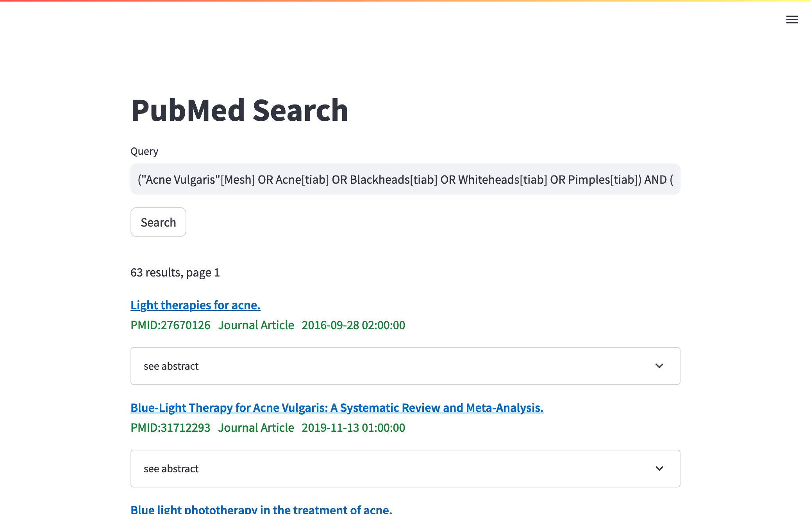

# pybool_ir-ui



This is a library for creating search interfaces for indexes created with [pybool_ir](https://github.com/hscells/pybool_ir), however any index created with [Lucene](https://lucene.apache.org/) is also compatible, including those from [pyserini](https://github.com/castorini/pyserini/).

**DEMO** https://pubmed.chatnoir.eu/

## Installation

Command line:

```bash
pip install -r requirements.txt
```

Docker:

```bash
make docker-build
```

## Usage

First, create a config file which specifies things like the index to use, and how the SERP should be rendered. For an example, take a look at [config-pubmed.toml](config-pubmed.toml).

Next, edit [.env](.env) to point to your config file.

Then, if you are running on the command line:

```bash
streamlit run app.py
```

Or, if you are running in Docker:

```bash
make docker-run
```

## Example

Want to see it in action?

1. Download and index the [CORD-19](https://www.semanticscholar.org/cord19) dataset.
```bash
pybool_ir ir-datasets index -c cord19/trec-covid -i index-treccovid -s1
```

2. Edit the [.env](.env) file to point to [config-treccovid.toml](config-treccovid.toml).

```bash
PBIRUI_CONFIG_FILE=config-treccovid.toml
```

3. Run the UI.
```bash
streamlit run app.py
```

OR

```bash
make docker-run
```

## Extending

### Implementing a SERP renderer

Implementations of how SERPs are must be included in [serp.py](serp.py). There are already some default implementations.

### Implementing a query parser

Implementing new query parsers is a little more tricky than new SERP renderers. This requires implementing the [QueryParser](https://scells.me/pybool_ir/_autosummary/pybool_ir.query.parser.html) class from [pybool_ir](https://github.com/hscells/pybool_ir).

## License

MIT